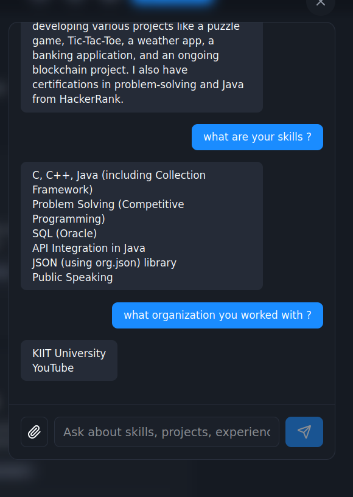
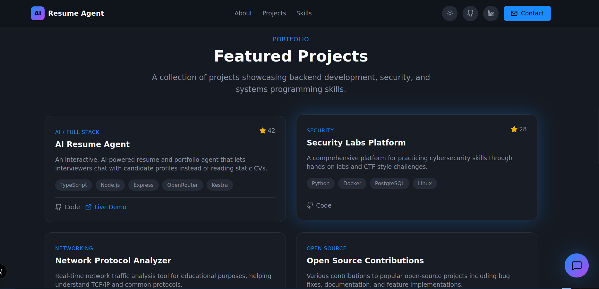
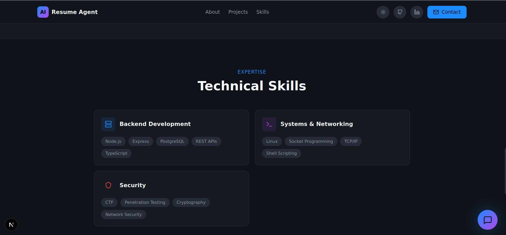

# AI Resume & Portfolio Agent

An interactive, AI-powered resume and portfolio agent that transforms static CVs into dynamic, conversational experiences. Built for the **AI AGENTS ASSEMBLE** hackathon by WeMakeDevs, this project showcases a comprehensive **portfolio + multi-agent system** with integrated chat interface.

**🚀 Live Demo**: [Portfolio Website](https://resume-agent-llm.vercel.app/)

### 🏠 Home Page


### 💬 Chat with AI



### 🛠️ Technical Skills View



### 📂 Projects Section



<br>
<br>


**⚡ Key Innovation**: Interactive AI agents that understand your profile and provide personalized insights for different career paths.

This project integrates all key sponsor tools:

- **OpenRouter** – LLM inference for intelligent analysis
- **Kestra** – workflow orchestration and automation
- **Vercel** – seamless deployment and hosting
- **Oumi** – AI model ranking and response evaluation
- **CodeRabbit** – automated code reviews and quality assurance
- **Cline** – autonomous development workflows and code scaffolding

---

## 🔍 What This Project Does

### Problem

Traditional static resumes fail to tell the complete story. Recruiters, mentors, and peers must navigate multiple platforms to understand:

- **Project Impact**: What you've actually built and its technical significance
- **Skill Depth**: Your capabilities in systems, networking, and security domains
- **Growth Trajectory**: How you've evolved through CTFs, DSA practice, and real-world projects
- **Role Fit**: How your experience aligns with specific job requirements

### Solution

This project is a **comprehensive AI-powered resume ecosystem** that:

- **Conversational Interface**: Chat with profiles instead of reading static documents
- **Role-Based Intelligence**: Dynamic summaries tailored for specific career paths
- **Project Deep-Dives**: AI explanations of architecture, challenges, and impact
- **Continuous Learning**: Automated workflows keep profiles updated and relevant
- **Multi-Agent System**: Specialized agents handle different aspects of profile analysis

---

## ✨ Key Features

### 1. Intelligent Chat Interface

- **Conversational Profile Analysis**: Natural language queries about skills, experience, and projects
- **Role-Based Responses**: Adapts communication style based on user type (recruiter, mentor, peer)
- **Real-Time Processing**: Instant AI-generated insights from profile data
- **Context-Aware**: Maintains conversation context for follow-up questions

### 2. Multi-Agent Profile Analysis

- **Profile Analyzer Agent**: Extracts and structures information from resume data
- **Role Matcher Agent**: Tailors summaries for specific career paths (backend, security, frontend, etc.)
- **Content Generator Agent**: Creates compelling narratives and project explanations
- **Learning Tracker Agent**: Monitors growth patterns and skill development over time

### 3. Automated Data Intelligence


- **Dynamic Summaries**: AI-generated role-specific summaries using OpenRouter LLM
- **Continuous Updates**: Kestra workflows maintain data freshness
- **PDF Processing**: Extract and analyze resume content from PDF documents

### 4. Advanced Analytics & Insights

- **Skill Assessment**: AI-powered evaluation of technical competencies
- **Project Impact Analysis**: Deep-dive into architecture, challenges, and outcomes
- **Career Trajectory**: Growth tracking through competitive programming, CTFs, and projects
- **Role Compatibility**: Matching profiles to job requirements and opportunities

---

## 🏗️ System Architecture

### Technology Stack

**Frontend Layer:**

- **Next.js 16.0.8** with App Router for modern React development
- **React 19.2.1** for component-based UI
- **TypeScript** for type-safe development
- **Tailwind CSS v4** for responsive, utility-first styling
- **Radix UI + Tailwind** for consistent, accessible UI components
- **Framer Motion** for smooth animations
- **React Markdown** for rich text rendering
- **Lucide React** for modern iconography

**Backend Layer:**

- **Node.js/Express** RESTful API server
- **OpenRouter Integration** for LLM-powered analysis
- **PDF Processing** with pdf-parse for document extraction

**Agent System (Current Implementation):**

- **Agent Service**: Chat functionality with profile analysis
- **Model Ranking**: Oumi-based evaluation of LLM responses
- **Resume Processing**: PDF and text analysis with AI summaries

**Data & Workflows:**

- **Kestra Workflows** for automated data processing
- **Structured Data Storage** in JSON format
- **Vercel Edge Functions** for serverless deployment

**External Integrations:**

- **OpenRouter** LLM inference engine
- **Vercel** deployment and hosting platform
- **CodeRabbit** automated code review

### System Architecture Diagram

```bash
┌─────────────────────────────────────────────────────────────────┐
│                        USER INTERFACE                           │
│  ┌─────────────────┐  ┌─────────────────┐  ┌─────────────────┐ │
│  │   Chat Panel    │  │  Project Cards  │  │  Role Selector  │ │
│  │                 │  │                 │  │                 │ │
│  │ [Chat Input]    │  │ [Project List]  │  │ [Role Buttons]  │ │
│  │ [AI Responses]  │  │ [Tech Details]  │  │ [Filters]       │ │
│  └─────────────────┘  └─────────────────┘  └─────────────────┘ │
└─────────────────────────────────────────────────────────────────┘
                                │
                                ▼ HTTP/WebSocket
┌─────────────────────────────────────────────────────────────────┐
│                        FRONTEND LAYER                           │
│                    Next.js 16.0.8 Application                    │
│  ┌─────────────────────────────────────────────────────────────┐ │
│  │  Components  │  Pages  │  Utils  │  Types  │  Styles        │ │
│  └─────────────────────────────────────────────────────────────┘ │
└─────────────────────────────────────────────────────────────────┘
                                │
                                ▼ HTTP REST
┌─────────────────────────────────────────────────────────────────┐
│                        BACKEND LAYER                            │
│                    Node.js/Express Server                       │
│  ┌─────────────┐  ┌─────────────┐  ┌─────────────┐  ┌─────────┐ │
│  │   Resume    │  │   PDF       │  │   Model     │  │  Agent  │ │
│  │ Controller  │  │ Processor   │  │  Ranking   │  │ Service │ │
│  └─────────────┘  └─────────────┘  └─────────────┘  └─────────┘ │
└─────────────────────────────────────────────────────────────────┘
                                │
                                ▼ External APIs
┌─────────────┐  ┌─────────────┐  ┌─────────────┐  ┌─────────────┐
│ OpenRouter  │  │   Vercel    │  │   Kestra    │  │   Oumi      │
│   LLM API   │  │ Deployment  │  │  Workflows  │  │  Ranking    │
└─────────────┘  └─────────────┘  └─────────────┘  └─────────────┘
                                │
                                ▼ Data Storage
┌─────────────────────────────────────────────────────────────────┐
│                        DATA LAYER                               │
│  ┌─────────────┐  ┌─────────────┐  ┌─────────────┐  ┌─────────┐ │
│  │   Profile   │  │  Projects   │  │  Generated  │  │ Scripts │ │
│  │     Data    │  │    Data     │  │ Summaries   │  │   &     │ │
│  │             │  │             │  │             │  │  Utils  │ │
│  └─────────────┘  └─────────────┘  └─────────────┘  └─────────┘ │
└─────────────────────────────────────────────────────────────────┘
                                │
                                ▼ Agent System
┌─────────────────────────────────────────────────────────────────┐
│                        AGENT SYSTEM                             │
│  ┌─────────────┐  ┌─────────────┐  ┌─────────────┐  ┌─────────┐ │
│  │   Agent     │  │   Model     │  │   Resume    │  │ Profile │ │
│  │   Service   │  │   Ranking   │  │   Analysis  │  │  Chat   │ │
│  │             │  │   (Oumi)    │  │             │  │         │ │
│  └─────────────┘  └─────────────┘  └─────────────┘  └─────────┘ │
└─────────────────────────────────────────────────────────────────┘
```

---

## 📁 Repository Structure

### Complete Directory Structure

```bash
resume-agent/
├── frontend/                          # Next.js Frontend Application
│   ├── app/                          # App Router pages
│   │   ├── layout.tsx                # Root layout component
│   │   ├── page.tsx                  # Home page component
│   │   ├── globals.css               # Global styles
│   │   └── favicon.ico               # Application icon
│   ├── components/                   # React Components
│   │   ├── ChatPanel.tsx             # Chat interface component
│   │   ├── Header.tsx                # Site header component
│   │   ├── HeroSection.tsx           # Hero section component
│   │   ├── NavLinks.tsx              # Navigation component
│   │   ├── ProjectCard.tsx           # Project display component
│   │   ├── RoleSelector.tsx          # Role filter component
│   │   ├── SkillsSelector.tsx        # Skills filter component
│   │   └── ui/                       # UI components
│   │       └── button.tsx            # Button component
│   ├── lib/                          # Utility libraries
│   │   └── utils.ts                  # Utility functions
│   ├── public/                       # Static assets
│   │   ├── file.svg                  # File icon
│   │   ├── globe.svg                 # Globe icon
│   │   ├── next.svg                  # Next.js logo
│   │   ├── vercel.svg                # Vercel logo
│   │   └── window.svg                # Window icon
│   ├── package.json                  # Frontend dependencies
│   ├── next.config.ts                # Next.js configuration
│   ├── tsconfig.json                 # TypeScript configuration
│   ├── tailwind.config.js            # Tailwind CSS configuration
│   ├── postcss.config.mjs            # PostCSS configuration
│   ├── eslint.config.mjs             # ESLint configuration
│   └── README.md                     # Frontend documentation
│
├── backend/                           # Node.js/Express Backend
│   ├── adapters/                     # External service adapters
│   │   └── openrouterAdapter.ts      # OpenRouter LLM integration
│   ├── controllers/                  # Request controllers
│   │   └── resumeController.ts       # Resume analysis controller
│   ├── mock/                         # Development mocks
│   │   └── togetherMockServer.ts     # Mock LLM server
│   ├── routes/                       # API route definitions
│   │   ├── agent.ts                  # Agent chat routes
│   │   ├── models.ts                 # Model ranking routes
│   │   ├── resume.ts                 # Resume analysis routes
│   │   └── together.ts               # LLM testing routes
│   ├── services/                     # Business logic services
│   │   ├── agentService.ts           # Agent chat service
│   │   ├── integrations.ts           # External integrations
│   │   ├── modelRanker.ts            # Oumi model ranking
│   │   ├── pdfService.ts             # PDF processing service
│   │   └── resumeService.ts          # Resume analysis service
│   ├── types.ts                      # TypeScript type definitions
│   ├── index.ts                      # Main server entry point
│   ├── cli-test.ts                   # CLI testing utility
│   ├── .env.example                  # Environment template
│   └── README.md                     # Backend documentation
│
├── agents/                           # AI Agent System
│   ├── index.ts                      # Agent exports
│   ├── resume-agent.ts               # Resume agent implementation
│   └── types.ts                      # Agent type definitions
│
├── data/                             # Data Storage
│   └── .gitkeep                      # Placeholder for data files
│
├── kestra/                           # Workflow Orchestration
│   └── workflows/                    # Kestra workflow definitions
│       └── workflow.yml              # Data processing workflow
│
├── scripts/                          # Utility Scripts
│   ├── generate-summaries.ts         # Multi-role summary generator
│   ├── README.md                     # Scripts documentation
│   └── test-agent.ts                 # Agent testing script
│
├── tests/                            # Test Scripts
│   ├── simple-test.sh                # Simple functionality test
│   ├── test-backend.sh               # Backend API tests
│   └── test-integration.sh           # Integration tests
│
├── logs/                             # Application Logs
│   ├── backend.log                   # Backend server logs
│   └── mock.log                      # Mock server logs
│
├── .coderabbit.yml                   # CodeRabbit configuration
├── .gitignore                        # Git ignore rules
├── package.json                      # Root package configuration
├── package-lock.json                 # Dependency lock file
├── tsconfig.json                     # TypeScript root configuration
├── vercel.json                       # Vercel deployment configuration
├── test-resume-upload.js             # Resume upload test script
├── test_payload.json                 # Test payload data
└── README.md                         # This documentation file
```

---

##  API Documentation

### Base URL

```bash
Local Development: http://localhost:3000
Production: https://your-app.vercel.app
```

### Authentication

Most endpoints require an `OPENROUTER_API_KEY` environment variable. For testing purposes, you can provide the API key in the request body or use the mock server for development.

### Endpoints

#### POST /api/resume/analyze

Analyzes resume text or PDF documents and generates AI-powered summaries tailored for specific career roles.

**Request:**

- **Content-Type:** `multipart/form-data` (for PDF) or `application/json` (for text)
- **Body (JSON):**

  ```json
  {
    "text": "Resume text content here...",
    "kind": "backend-engineer" // Optional: role type for tailored analysis
  }
  ```

- **Body (PDF Upload):**
  - Form field: `file` (PDF file, max 10MB)
  - Form field: `kind` (optional role type)

**Response:**

```json
{
  "summary": "AI-generated summary tailored for the specified role...",
  "inputLength": 1250,
  "engine": "openrouter",
  "timestamp": "2024-01-15T10:30:00.000Z",
  "pdfInfo": {
    "pageCount": 2,
    "extractedAt": "2024-01-15T10:30:00.000Z"
  }
}
```

**Status Codes:**

- `200` - Success
- `400` - Invalid request (missing text/file, invalid PDF)
- `500` - Server error

#### POST /api/agent/chat

Interactive chat with AI agents for profile analysis and career insights.

**Request:**

```json
{
  "message": "What programming languages does this candidate know?"
}
```

**Response:**

```json
{
  "response": "Based on the resume analysis, the candidate demonstrates proficiency in JavaScript, TypeScript, Python, and Java..."
}
```

#### GET /api/agent/status

Get agent system status and available role types.

**Response:**

```json
{
  "ready": true,
  "availableRoles": ["backend-engineer", "frontend-engineer", "fullstack-developer"],
  "message": "Agent is ready to chat"
}
```

#### GET /api/models/rank

Get current model performance rankings.

**Response:**

```json
{
  "success": true,
  "rankings": [
    {
      "modelName": "mistralai/mistral-7b-instruct",
      "score": 0.85,
      "evaluations": 15
    }
  ],
  "bestModel": "mistralai/mistral-7b-instruct"
}
```

#### POST /api/models/evaluate

Evaluate a specific model's response quality.

**Request:**

```json
{
  "text": "Sample resume text...",
  "model": "mistralai/mistral-7b-instruct",
  "kind": "backend-engineer"
}
```

#### POST /api/llm/test

Tests the LLM integration with custom input and instructions. Useful for development and debugging.

**Request:**

```json
{
  "input": "Text to analyze",
  "instruction": "Summarize this text in 2-3 sentences", // Optional
  "kind": "backend-engineer", // Optional: role context
  "apiKey": "your-api-key", // Optional: override environment key
  "model": "mistralai/mistral-7b-instruct" // Optional: specify model
}
```

**Response:**

```json
{
  "result": "AI-generated response based on input and instruction..."
}
```

#### GET /health

Health check endpoint to verify API availability.

**Response:**

```json
{
  "status": "healthy",
  "timestamp": "2024-01-15T10:30:00.000Z",
  "version": "1.0.0"
}
```

### Error Handling

All endpoints return errors in the following format:

```json
{
  "error": "Error message description"
}
```

Common error scenarios:

- Missing or invalid API keys
- Unsupported file types or sizes
- LLM service timeouts
- Invalid request parameters

---

## 🚀 Deployment Guide

### Vercel Deployment

1. **Connect Repository**
   - Import your GitHub repository to Vercel
   - Configure build settings:
     - Build Command: `npm run build`
     - Output Directory: `.next` (for frontend) or `dist` (for backend)
     - Install Command: `npm install`

2. **Environment Variables**
   Set the following in Vercel dashboard:

   ```bash
   OPENROUTER_API_KEY=your_openrouter_api_key
   OPENROUTER_API_URL=https://openrouter.ai/api/v1/chat/completions
   OPENROUTER_MODEL=mistralai/mistral-7b-instruct
   ```

3. **Frontend Deployment**
   - Deploy from `frontend/` directory
   - Configure domain and SSL
   - Enable preview deployments for PRs

4. **Backend Deployment**
   - Deploy API routes as serverless functions
   - Configure CORS for frontend domain
   - Set up monitoring and logging

### Kestra Workflow Setup

1. **Install Kestra**

   ```bash
   # Using Docker
   docker run --rm -p 8080:8080 kestra/kestra:latest
   ```

2. **Configure Workflows**
   - Import workflow files from `kestra/workflows/`
   - Configure automated triggers for data processing
   - Set up data storage connections

3. **Schedule Automated Updates**
   - Configure automated data processing workflows
   - Set up summary regeneration triggers
   - Monitor workflow execution logs

### Production Checklist

- [ ] Environment variables configured
- [ ] SSL certificates enabled
- [ ] Rate limiting implemented
- [ ] Error monitoring set up
- [ ] Backup strategies in place
- [ ] Performance monitoring enabled

---

## 🗺️ Future Roadmap

### Phase 1: Enhanced Agent System (Q1 2025)

- [x] Basic agent chat functionality
- [x] Model ranking with Oumi
- [ ] Expand agent capabilities with more specialized roles
- [ ] Implement inter-agent communication protocols

### Phase 2: Advanced Intelligence (Q2 2025)

- [ ] Learning Tracker Agent for growth analysis
- [ ] Advanced conversation memory and context
- [ ] Multi-language support for global users
- [ ] Custom agent training capabilities

### Phase 3: Ecosystem Integration (Q3 2025)

- [ ] CodeRabbit integration for automated code reviews
- [ ] Cline integration for autonomous development
- [ ] Advanced Kestra workflows for complex data pipelines
- [ ] Real-time collaboration features

### Phase 4: Enterprise Features (Q4 2025)

- [ ] Team portfolio management
- [ ] Advanced analytics dashboard
- [ ] API marketplace for third-party integrations
- [ ] Enterprise security and compliance

### Long-term Vision

- **Autonomous Career Development**: Agents that proactively suggest improvements
- **Industry-Specific Intelligence**: Specialized agents for different sectors
- **Global Talent Network**: Cross-platform profile aggregation
- **AI-Powered Mentorship**: Intelligent matching with mentors and opportunities

---

## 🤝 Contributing

We welcome contributions! Please see our [Contributing Guide](CONTRIBUTING.md) for details.

---

## 🙏 Acknowledgments

- **WeMakeDevs** for the AI AGENTS ASSEMBLE hackathon
- **OpenRouter** for LLM infrastructure
- **Kestra** for workflow orchestration
- **Vercel** for seamless deployment
- **Oumi** for AI model evaluation
- **CodeRabbit** for automated code reviews
- **Cline** for autonomous development tools
